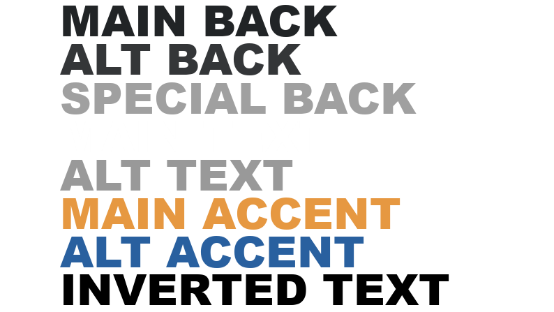

# Customization

---

There are a few parts of the MTP client which can be modified externally to allow customization such as custom sounds, backgrounds, and colors. All customizable files are in the GUI directory in the client directory.

---

## *NOTE\* - Prior to v3.4.3, the updater overwrote these files with the default versions with every update. This behaviour will be altered to allow customization but your updater must be upgraded to v3.4.3 or later by installing from github if you wish to customize the default files and not have them be overwritten.

---

## Themes

Themes allow you to modify all of the colors used in the client. In the Themes folder, you'll find two json files. All colors used by the client are defined by these files. The client searches this folder for json files so additional themes can be added and the default themes can be modified. 

A standard theme json files requires the following definition

```json
{
  "MainBackColor": "#AARRGGBB",
  "AltBackColor": "#AARRGGBB",
  "SpecialBackColor": "#AARRGGBB",
  "MainTextColor": "#AARRGGBB",
  "AltTextColor": "#AARRGGBB",
  "InvertedTextColor": "#AARRGGBB",
  "MainAccentColor": "#AARRGGBB",
  "AltAccentColor": "#AARRGGBB"
}
```

Each color uses ARGB hex code notation.

The below image shows the default dark theme colors to help with visualising your customization.

    

Main Back is used for any dark backgrounds.

Alt Back is used for the background of any dialogs and controls such as the user input box in the lobby or the lighter part of the console gradient. 

Special back is used for dividers and small controls which need to be lighter to match the contrast of other controls which use Alt Back.

Main Text is the primary font color used for almost all text.

Alt Text is used when the text does not need to stand out.

Main Accent is used for buttons and flares.

Alt Accent is primarily used as a highlight or selection color.

Inverted Text should be opposite to Main Text in lightness / contrast.

It is best practice to leave keep Main Text and Inverted Text as black and white. For light themes, make the Main Text color black and for dark themes make it White.

--- 

## Sounds

Swapping out the sounds is even easier than making custom themes. Simple locate the Sounds directory and note down the name of the sound you want to swap. Then replace it with your desired sound ensuring the name is identical to the original.

---

## Graphics

The final customizable aspect of the client is the koala selection images and the Ty theme background used on the splash screen and koala select. It's unlikely you'd want to change these assets but all are available in the Koala Selection Assets directory and can be swapped similarly to the Sounds.

## Hotkeys

Hotkeys can be customized in the Hotkeys.json file. The application must be restarted for this to take effect and the file is overwritten on update. This is unlikely to be fixed soon (v3.4.9).