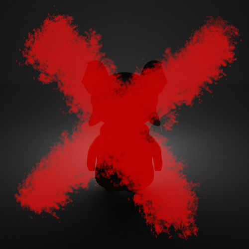
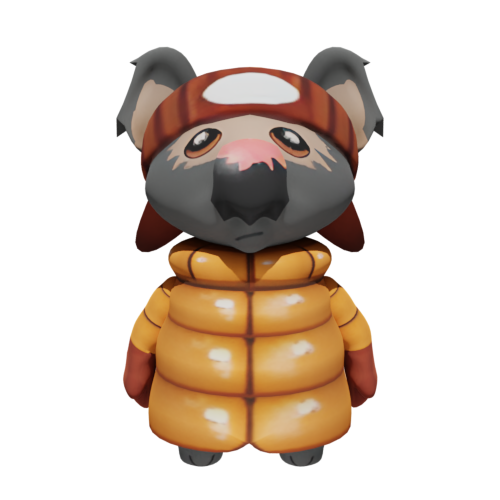
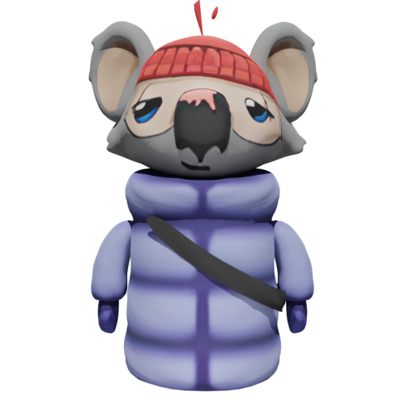
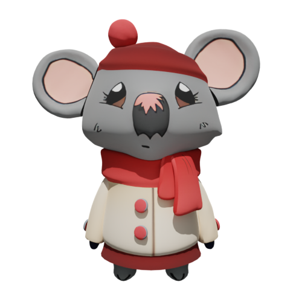
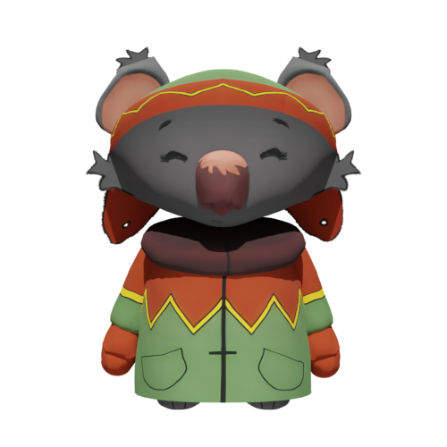
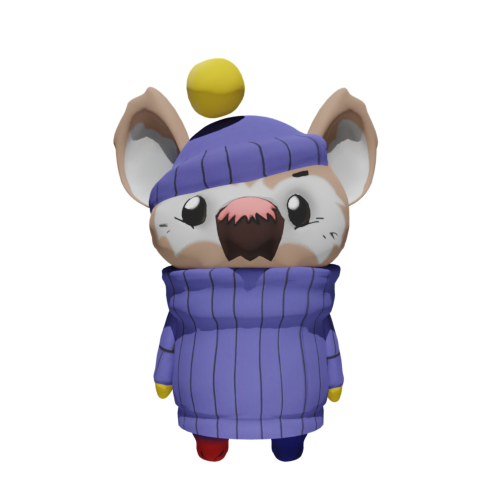
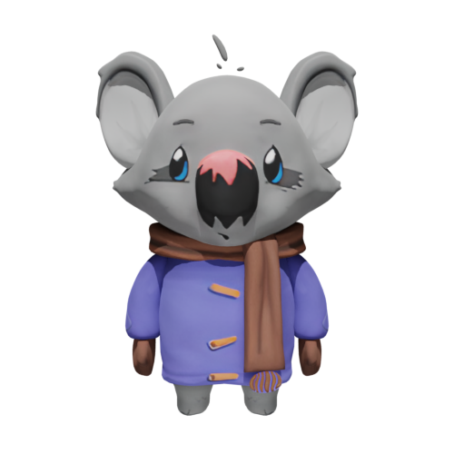
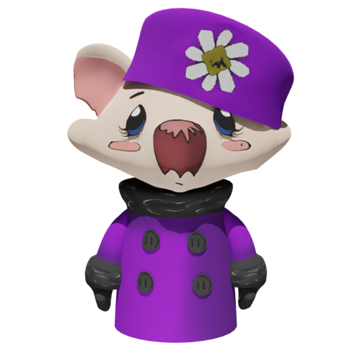
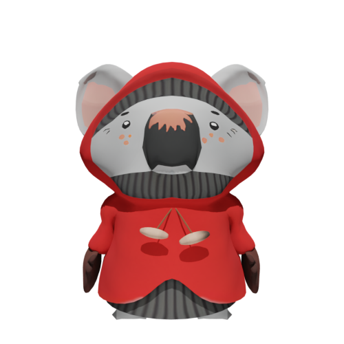

# Koala Select

Once you've logged in, you'll be taken through to a screen where you'll choose your koala. Each koala can only be chosen once so choose wisely. If a koala is taken, it will have a cross through it.

## The Koalas

For better communication, provided below is a basic overview of the Koalas

Boonie is the troublemaker of the group. In Ty2, his mother is revealed to have passed. He is featured in several missions across Ty1 and Ty2 and is present in Ty3.

Mim is the tallest koala after Katie suggesting he may be the oldest male koala under Shiela's care. For some unknown reason, his texture is significantly lower quality than the others.

Katie is by far the largest koala under Shiela's care and likely the oldest of the group.

Kiki is the only koala besides boonie to referenced by name in the game by Shiela in one of the cutscenes.

Snugs is the smallest and likely the youngest koala in the group and has a singular red boot.

Dubbo's face was used for the Koala objective icon and therefore the Mul-Ty-Player exe icon.

Elizabeth was modelled off of Queen Elizabeth II and is even named as such in the files.

Gummy has absolutely nothing noteworthy about him.
