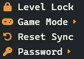

# Lobby Tour

---

The lobby is the main view you'll be seeing when using the client. It's good to be familiar with what every section does and means.

---

## Player Info

1-7 is the Player info list. This contains general information about the players and their status while connected to the server.

##### 1 - Client Id

This is a number used to represent the person connected. It is used for certain [commands](./Commands/Commands.md) such as [/tp](./Commands/Teleport.md) and [/whisper](./Commands/Whisper.md). 

##### 2 - Koala Icon

This is a vector image used to display which koala someone is using. The background of the image is the color scheme of the koala and the letter is the initial of the Koala's name. For more information on the koalas, see [koala selection documentation](./KoalaSelect.md). 

##### 3 - Player Name

This displays the first ~13 characters of each player's name. If the name is longer, it is truncated but hovering over the name will display the full name. Since most commands are handled either in the UI or by using the client id, the name never needs to be typed out in full and serves more as an indicator of who is connected.

##### 4 - Host Icon

This displays next to the player who is designated host of the group. For more information on how the host system works see [host system documentation](./Host.md).

##### 5 - Level Code

This displays the in game level code for the level that each player is currently in. It is worth learning the level code system since it makes it easier to figure out where someone is. A full list of level codes in the PC release is documented [here](./LevelCodes.md). Hovering over the level code will display a tooltip with the level name if you're unsure.

##### 6 - Ready Icon

This icon appears when a player is in the ready state. The ready state is used to activate countdowns. For more information on how the ready system works see [ready system documentation](./Ready.md).

##### 7 - Hide & Seek Role

This icon appears during Hide & Seek Mode and displays the role of the player. For more information on Hide & Seek Mode see [hide & seek documentation](./HideSeek.md).

#### Host Context Menu

The Host Context Menu is a menu only available to the [host](./Host.md) through right clicking a player in the Player Info List. This menu allows the host to perform client specific actions quickly such as kicking a player of transferring host.

---

## Lobby Toolbar

8-14 is the Lobby Toolbar containing a set of buttons.

##### 8 - Settings Menu Button

Marked by a gear icon. Opens the settings menu. For detailed information on all of the settings see [settings documentation](./Settings.md).

##### 9 - Ready Button

Marked by a person with a checkmark icon. Toggles ready status. For more information on how the ready system works see [ready system documentation](./Ready.md).

##### ~~10 - Launch Game Button~~

~~Marked by a gamepad icon. Launches the game if the path is known by the client. This button will be grayed out if a valid instance on MTP is open and hooked into. The button will only be enabled in the case where the user has the "Auto-Restart Ty" settings disabled and closes their game.~~

*Removed

##### 11 - Request Sync Button

Marked by a rotating arrows icon. Pings the server to ask for collectible synchronisation data in the event of a desync.

##### 12 - Host Menu Button

Marked by a crown icon. Opens the host context menu. The menu is only accessible to the [host](./Host.md) of the group and contains options to

- Toggle [Hide & Seek Mode](./HideSeek.md)

- Toggle [Level Lock Mode](./LevelLock.md)

- Reset Sync - Resets all collectibles back to the uncollected state in the server and client. Note that everyone connected should be on the main menu when this button is pressed in order for the collectibles to be fully reset. See [syncing documentation](./Syncing.md).

- Clear Password - Resets password to default "XXXXX", allowing anyone to join.

##### 13 - Hide & Seek Menu Button

Marked by either a footprints or magnifying glass icon. This button only appears when Hide & Seek Mode is active and is available to all clients connected. It contains Hide & Seek related options to 

- Change Role

- Toggle Timer - Only used in Hide & Seek Mode

- Reset Timer

For more information about how Hide & Seek works, see [hide & seek documentation](./HideSeek.md).

##### 14 - Disconnect Button

Marked by a door with an arrow icon. Disconnects you from the server and puts you back to the login screen.

---

## Console

15-17 is the console view which is the best and often most efficient way of interacting with the server. Learning how to use the various [commands](./Commands/Commands.md) can make the whole MTP experience much easier.

##### 15 - Console

The console itself displays messages with various prefixes. 

| Prefix                 | Meaning                                                                                              |
| ---------------------- | ---------------------------------------------------------------------------------------------------- |
| ClientName             | Message from client which everyone can see.                                                          |
| ClientName [WHISPERED] | Message from client which only you can see.                                                          |
| (CLIENT) / (SERVER)    | Informative messages or errors with the server or client networking.                                 |
| [ERROR]                | Usually warning you that you did something incorrectly such as not using the correct command syntax. |
| [WARN]                 | Warnings. Not necessarily fatal but worth keeping in mind such as mismatched client-server versions. |
| [HIDE AND SEEK]        | Hide & Seek Mode messages.                                                                           |

##### 16 & 17 - User Input Box

Used to run [commands](./Commands/Commands.md). The input box accepts the return key but mouse lovers can still click the send button (17). The box also supports command recall by pressing the up and down keys to cycle through previously called commands.
